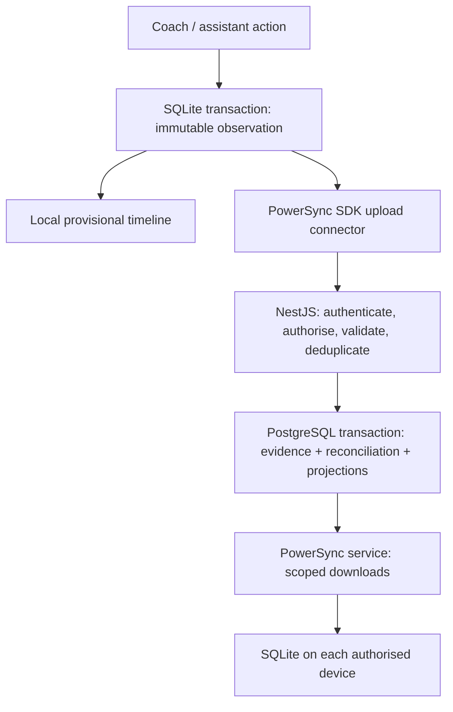

# Offline collaborative event logging: implementation plan

Status: first implementation slice completed on 17 September 2026. The repository now includes immutable observations, deterministic duplicate anchoring and review, PowerSync-backed browser SQLite, a retry queue, offline session/match caching, an installable PWA, PowerSync authentication, and scoped Sync Streams. Production activation still requires applying migration `0021`, configuring the PowerSync service/publication, and setting the documented environment variables.

Use a PWA with PowerSync-managed local SQLite, retain NestJS and Neon/PostgreSQL, and introduce immutable observations and operations from which the server derives canonical match events. PowerSync transports data; the application decides how observations affect the result.

## 1. Requirement and delivery boundary

**User story:** As a coach or assistant, I can record match actions without internet connectivity and synchronise them later, including when other assistants independently record the same match.

The guarantee is eventual convergence: given the same accepted observations, resolution operations, and rules version, every device displays the same canonical events, result, penalties, and disciplinary totals. Devices that cannot communicate can temporarily show different provisional information. This release does not provide LAN, Bluetooth, or mesh synchronisation.

Initial scope includes pre-downloaded matches and squads, all existing logger event types, durable offline capture, eventual upload, duplicate review, auditable corrections, and offline reopening. Initial sign-in, downloading a new match, roster administration, and authoritative report finalisation require connectivity. Capture must remain possible after local full time so late observations can be reviewed.

“Saved on this device” means the SQLite transaction committed. It does not mean uploaded, accepted, reconciled, or downloaded by another assistant. Browser storage deletion, device loss, and storage eviction remain limits; expose storage readiness and recovery options rather than promising unconditional durability.

## 2. What exists and what must change

| Existing implementation | Planned change |
| --- | --- |
| `backend/src/database/schema/index.ts`: `match_events`, actor attribution, per-match `client_request_id` uniqueness | Preserve canonical events; add observations, operations, observation membership, review state, and projection revisions. |
| `backend/src/matches/matches.service.ts`: direct inserts, updates and deletes; score counts goal rows | Route capture and corrections through one command/reconciliation service; filter effective canonical rows consistently. |
| `backend/src/matches/matches.schemas.ts`: integer minute, scored penalty represented as `goal` + `detail="Penalty"`, incoming substitution player stored in detail | Introduce versioned structured payloads, period, elapsed milliseconds and clock quality; migrate legacy conventions explicitly. |
| `matches` already stores clock period, elapsed milliseconds and start time | Extend existing clock with revision and authority; persist a local clock anchor. |
| `backend/src/statistics/statistics.service.ts`: goal/card counts and substitution attribution read ledger fields directly | Update these readers and report/public consumers together; test legacy parity. |
| `frontend/src/features/matches/{api,hooks,types}.ts`, `LiveMatchPage.tsx`, `LiveLoggerPage.tsx` | Introduce local repository and reactive SQLite reads; remove network dependence from capture. |
| `frontend/src/context/AuthContext.tsx` and `components/ProtectedRoute.tsx` | Add an explicit previously-authorised offline state; current unavailable-session screen blocks reopening the logger. |
| `backend/src/teams/teams.service.ts`: coach/assistant membership | Reuse membership checks; introduce explicit permissions for capture, corrections, review, clock control and finalisation. |
| `backend/src/database/drizzle.ts`: Neon HTTP driver | Prove atomic ingestion/reconciliation with the selected driver; use an interactive-transaction-capable connection for this path if required. Do not assume arbitrary callback transactions work here. |
| Vite frontend with no PowerSync dependencies or PWA plugin configured | Add browser persistence, workers/WASM bundling, manifest, service worker and production offline tests. |

## 3. Data flow and invariants

Uploads go from the client connector to NestJS, not through the PowerSync service to an unrestricted database writer. The service streams database changes back to devices.

Invariants:

1. One user action gets one client-generated UUID before any network request; retries retain it. UUIDv4 is sufficient; UUIDv7 is optional and never determines football chronology.
2. Identical ID and payload retries are idempotent. Reusing an ID with different content is an explicit conflict, never an overwrite.
3. Original observations and correction commands are immutable. Derived membership, review state and canonical materialisations may change.
4. Clients never increment shared scores or write canonical rows. Score and disciplinary totals derive from effective canonical events.
5. No merge decision depends on upload arrival time, database insertion order, device wall-clock ordering, or a random server-generated tie-break.
6. A successful upload is acknowledged only after its evidence and durable processing outcome commit to the source PostgreSQL database.
7. Local pending entries are overlaid by observation identity, so downloading their accepted canonical events cannot temporarily double-count them.

## 4. Proposed schema and contracts

Add Drizzle migrations under `backend/drizzle/` and definitions in `backend/src/database/schema/index.ts`.

| Table / extension | Essential fields and constraints |
| --- | --- |
| `match_event_observations` | Client UUID PK, match ID, device ID, authenticated actor ID, schema version, event type, side, player references, period, elapsed milliseconds, clock revision/quality, structured payload, client timestamp, server receipt timestamp, payload hash. Match/player/team references validated server-side. |
| `match_event_operations` | Client UUID PK, match ID, actor, operation type (`correct`, `void`, `merge`, `separate`, `resolve_conflict`), target observation IDs, optional canonical reference, explicit causal parents, structured replacement/decision, reason and schema version. |
| `match_event_memberships` | Server-owned mapping from each observation to its current canonical event and projection revision. Supports multiple witnesses without deleting evidence. |
| `match_event_reviews` | Deterministic conflict identity, involved observation/operation IDs, reason, resolution state and revision. |
| `match_events` extension | Structured payload, period, elapsed milliseconds, lifecycle/review status, rule version and projection revision. Preserve existing IDs for legacy rows. |
| `match_projection_state` | Match PK, revision, input digest, rules version, score, disciplinary projection, unresolved-review count, finalisation state. |
| Upload receipts | Durable per-operation accepted/rejected/dependency-pending outcome, payload hash and safe error code; scoped to submitting user. |

Keep observation processing status separate from immutable evidence. Index observations and operations by match, memberships by observation, and receipts by submitting user/operation. Match consistency must be checked across every foreign reference. Do not replicate unrelated personal data or auth/session tables.

Structured payloads must distinguish ordinary goals, penalty kicks and their outcomes, cards, substitutions with both player IDs, and existing non-scoring actions. Define whether `team` is the scoring beneficiary or acting side, including own goals. A scored penalty produces exactly one scoring contribution. Keep shootout totals separate from match score if shootouts are added; shootouts and competition-specific suspension rules are outside the initial release.

For compatibility, a scored penalty can initially materialise as an existing `goal` row plus structured `goalKind=penalty`; a missed penalty remains `penalty`. New rules read structured fields. Adapt legacy report text centrally instead of using text to decide semantics.

Proposed NestJS routes, under the existing API prefix convention:

- `POST /sync/token`: exchange an existing authenticated session for a short-lived PowerSync JWT with verified subject/audience; configure signing keys and rotation.
- `POST /sync/upload`: accept bounded typed observation/operation batches. Only approved insert commands are accepted; arbitrary table CRUD is forbidden.
- Match review query endpoints for observations, unresolved groups and audit history; use the same operations contract for review submissions.
- Coach-only finalise/reopen commands carrying the expected projection revision.

Derive actor identity from authentication, never from a client `loggedByUserId`. Validate current membership, match scope, player references, event schema, payload limits and operation permissions. Prefer coach-only merge/separate/finalise and correction resolution initially; assistants capture and may propose corrections. Document this policy as a deliberate change from the existing broadly team-scoped mutation paths.

## 5. Deterministic reconciliation and review

Create a framework-independent `packages/match-domain/` package shared by backend and frontend, with versioned validation, ordering, candidate detection and projection functions. Wire its build/imports into both TypeScript configurations and Jest; the repository currently has no shared package setup.

Treat reconciliation as a function of the full accepted input set and rules version. Recompute the affected match first; optimise incrementally only after replay equivalence is tested.

1. Normalise observations without inventing missing precision. Preserve original values alongside derived interpretations.
2. Identify candidate relationships using match, period, event family, side, player references, outcomes, elapsed time and clock quality. Missing players, disagreeing outcomes and poor clocks are review signals, not proof of separate events.
3. Use a versioned candidate window, initially a configurable five seconds for field evaluation. This is a review heuristic, not an automatic merge guarantee.
4. For the first release, never automatically collapse independently captured scoring or disciplinary actions merely because they are close in time. Exact retransmissions deduplicate by ID; independent UUIDs need explicit resolution when plausibly duplicated. This trades some review work for avoiding silent loss of genuine actions.
5. Sort candidates by explicit stable keys. Detect time-window chains: A near B and B near C does not prove A and C are one incident. Group connected candidates for review without treating the entire group as a merged event.
6. A coach resolves a group as same incident, separate incidents, corrected incident, or void. “Separate” is a persistent constraint so later replay cannot re-merge it. New evidence against a resolved group can reopen review.
7. Concurrent incompatible decisions remain unresolved; do not select whichever upload arrived first. Causally later decisions can explicitly supersede known prior decisions. Missing parent operations remain pending until available. A resolution names all conflicting operation IDs it supersedes.
8. Generate provisional canonical identities deterministically from observation anchors. Resolved groups use the resolving operation as an anchor; retain aliases/membership history when groups merge or split. Operations always retain observation targets, so late evidence cannot strand corrections against a disappearing materialised ID.
9. Apply corrections to the resolved incident while retaining original evidence for matching. A late observation of the original scorer must not undo an accepted scorer correction or revive a voided incident automatically.

Define output status precisely: `provisional` means an accepted unreviewed incident; `confirmed` means explicitly reviewed; `needs_review` means competing interpretations; `voided` contributes nothing. Show an official confirmed subtotal and a clearly labelled provisional live estimate. For unresolved duplicate groups, withhold the ambiguous group's contribution from the confirmed subtotal and show its possible effect separately. Never present an unresolved result as final.

Disciplinary projection must explicitly handle two yellows leading to dismissal, direct reds, a separately observed dismissal following a second yellow, corrections and voids. Preserve card evidence but count one dismissal per incident. Contradictory card sequences require review. Illegal substitutions and unknown player attribution likewise need a defined review outcome rather than silently modifying the squad.

## 6. Atomic persistence, retries and late arrivals

Serialise reconciliation per match inside a database transaction, using a transaction-scoped match lock or revision compare-and-swap with retries. Read the complete accepted set, reconcile, update canonical events/memberships/reviews/projections and commit together. A second request must never overwrite a projection built from an older input set.

The initial implementation should synchronously reconcile each bounded match batch. If processing later moves to a worker, commit the evidence and durable job together and explicitly distinguish upload acceptance from projection completion.

Network failures, timeouts, 429s and transient 5xx responses retain the SDK transaction for retry with backoff. A lost success response safely retries the same IDs. Authentication expiry pauses uploading and requests sign-in while preserving local capture and pending evidence.

Permanent validation rejection must not block all subsequent uploads. Persist a safe rejection receipt where authorised, retain the rejected payload in a local recovery store, and only then complete the corresponding SDK transaction. Resolve each item before completing a multi-item transaction; never blanket-acknowledge a failed batch. For revoked access, lock the affected local workspace and retain quarantined pending data without sending it under another identity. Test the exact receipt/quarantine behaviour against the chosen SDK.

Match completion is not proof that every offline device has uploaded. Separate full time from coach finalisation. Authorised late observations remain evidence: before finalisation they trigger normal reconciliation; after finalisation they open an amendment review without silently changing a published result. Finalisation requires no known unresolved reviews and an explicit coach acknowledgement that some disconnected devices may still have unsent work.

## 7. PowerSync, local persistence and PWA

Use `@powersync/web` and its React integration, with versions pinned after a compatibility spike. Store match metadata, squads/opponents, clock anchors, permitted observations/operations, canonical events, reviews and projection state in SQLite. Use reactive local queries for the logger; keep TanStack Query for features that remain online.

Configure Neon logical replication, a dedicated restricted replication user, and an explicit publication containing only required tables. Keep the existing Better Auth/NestJS boundary; the Neon sample's alternative auth and Data API setup are not required by this design. Validate connections in staging before touching production. [Neon integration documentation](https://docs.powersync.com/integrations/neon)

Define user/membership-scoped Sync Streams for match data. A client-supplied match ID selects a subscription but cannot grant access. Test two separate teams and membership revocation. Upload authorisation remains a separate NestJS responsibility. [Download/upload permission boundaries](https://docs.powersync.com/integrations/supabase/rls-and-sync-streams)

Prototype OPFSCoopSyncVFS on the target Android and iOS devices; retain a tested persistent IndexedDB-backed SQLite fallback where appropriate. Explicitly test multiple tabs and installed-PWA/browser combinations. Never substitute an in-memory database when advertising durable offline capture. The SDK documents different persistence and multi-tab support across VFS options. [Web SDK storage options](https://docs.powersync.com/client-sdks/reference/javascript-web)

The upload connector must only call transaction completion after the source database commit or a handled permanent outcome. This matches PowerSync's default synchronous write checkpoint model. [Write checkpoint requirements](https://docs.powersync.com/handling-writes/custom-write-checkpoints)

PWA tasks:

- Add manifest, icons and a Vite-compatible service worker; cache the app shell, offline route fallback, fonts, worker scripts and SQLite WASM assets.
- Do not cache authenticated API responses as a generic offline substitute. SQLite is the match data store.
- Defer service-worker activation/reload during capture or pending writes; keep old app/schema versions compatible during rollout.
- Namespace databases by environment and user. Never open a previous user's database for a new session.
- Permit offline logger access only for a previously authorised cached profile and prepared match. Recheck server permissions at upload. Expired credentials do not grant new server access.
- On sign-out/account switch, stop sync and close the database. Pending changes require a clear retain-for-same-user or explicit discard flow; do not automatically erase unsent entries.
- Request persistent storage where supported, check quota, and fail visibly when a local write cannot commit. Support a controlled export/import of unsent observations retaining their IDs, schema versions and ownership checks.
- Resume uploads when the application runs with connectivity. Do not promise synchronisation after the browser is closed.

Persist clock anchors containing period, elapsed time, running state, authority revision and local anchor time. Use monotonic elapsed time while running; on reload/suspend reconcile against the persisted anchor and flag uncertain timing after wall-clock changes. Preserve the timestamp captured with each observation. Coach clock commands are versioned operations; assistants cannot overwrite the shared clock. Offline clocks are estimates, so millisecond storage must not be presented as millisecond accuracy.

## 8. Match-day experience

Before departure, “Prepare for offline use” downloads the selected match, squads, event configuration, rules version and current ledger. Readiness checks app-shell availability, completed initial sync, required rows, successful local write/read, and storage capacity. Test readiness with a real offline reopen, not just `navigator.onLine`.

During capture show distinct states: saved locally, queued, uploading, accepted, reconciled, rejected, and needs review. Display pending count, last successful sync and provisional result status. Only show saved feedback after the local commit. A duplicate-review panel shows observers, players, clock confidence and outcomes, with same-event/separate/correct/void actions and an audit trail.

Render canonical rows and pending evidence through one repository/view model. Once membership arrives, remove the corresponding pending overlay atomically. Apply canonical rows and totals from a consistent revision; never show a new score alongside an older event list. Verify downloaded transaction/checkpoint behaviour and gate revision changes if necessary.

## 9. Delivery sequence and acceptance gates

| Phase | Work and likely locations | Exit gate |
| --- | --- | --- |
| 0. Technical spike | Disposable Neon/PowerSync setup; Vite workers/WASM; database transaction proof; Android/iOS browser trials; hosting/region/cost decision | Two devices persist offline, restart and exchange authorised test rows; cross-team downloads fail; transaction rollback demonstrated. |
| 1. Domain foundation | `packages/match-domain/`, schema migrations, structured payload adapters, replay fixtures | Goals, penalties, cards and substitutions project correctly; all permutations of fixed input sets produce equivalent semantic state. |
| 2. Backend ingestion | New `backend/src/sync/` and `backend/src/match-reconciliation/`; integrate matches/auth/teams | Idempotency, permission checks, rejection recovery and concurrent requests pass real database integration tests. |
| 3. Single-device offline slice | `frontend/src/offline/`, match repository/hooks, auth offline state, PWA setup | Prepared match opens with API and internet unavailable; new actions survive process restart and upload once. |
| 4. Collaborative capture | Scoped streams, memberships, revision-consistent UI, review and operations | Three independent devices reconnect in every order, including duplicates and corrections, and converge. This is required for the brief, not an optional enhancement. |
| 5. Consumer migration | Match report/model, statistics service, public/report APIs, clock/finalisation workflows | Every result/report consumer agrees; legacy fixtures retain score and disciplinary parity. |
| 6. Field trial and rollout | Production-build tests, physical devices, telemetry, runbook, per-match feature flag | Full simulated match passes with network loss, restarts, stale clients and late uploads; release gates below pass. |

Do not assign sprint dates until phase 0 establishes SDK/browser compatibility and the team's available capacity. Deliver each phase as a reviewable PR; split domain/schema, ingestion, client persistence and collaboration UI when necessary.

## 10. Migration and rollout

1. Inventory all `match_events` consumers, including public API, reports, exports, statistics, frontend projections and seed scripts.
2. Add schema without removing legacy columns. Backfill each existing event as one explicitly trusted legacy observation, preserving event IDs and existing results. Do not fuzzy-deduplicate historical records.
3. Map known penalty strings and substitution IDs into structured payloads. Mark unknown values and minute-only timing as legacy/low confidence; do not invent seconds.
4. Compare old and new projections for every migrated match; manually review any difference before enabling writes.
5. Route existing REST mutations through the command service for enabled matches. Reject incompatible stale clients clearly; never allow one path to bypass reconciliation or physically delete canonical evidence.
6. Pin rules version and capture mode per match. Roll out to internal trial matches, then selected teams, then wider use.
7. Rollback disables new feature activation while retaining the upload endpoint, schema and queue compatibility for already-enabled matches. Never strand existing offline writes or revert them to direct ledger inserts.

## 11. Verification and definition of done

Add domain tests, NestJS integration tests against an isolated real PostgreSQL database, and Playwright tests against a production PWA build. Existing dev-server browser tests alone cannot establish service-worker/offline behaviour. Add shared-package and frontend domain tests to CI explicitly.

| Scenario | Required result |
| --- | --- |
| Same operation uploaded repeatedly, including response lost after commit | One immutable observation and one effect; changed payload with same ID is rejected. |
| Three observers log one goal at nearby times | All evidence remains; review is explicit; same-event resolution yields one goal on every device. |
| Two genuine close goals/cards; time-window chain | Separate resolution preserves both; no silent fuzzy collapse. |
| Penalty scored/missed disagreement, goal versus penalty description | Review required; no double goal and no arbitrary outcome winner. |
| Second yellow plus separately recorded red | Evidence retained; dismissal counted once after resolution. |
| Correction/void before late duplicate arrives | Correction persists; void is not silently reversed. |
| Concurrent incompatible corrections, resolutions or clock commands | Same conflict set for every arrival order; explicit superseding resolution converges. |
| A reconnects first, B first, interleaved and repeated uploads | Same semantic events, memberships, score, penalties and input digest after convergence; receipt times/revision counters may differ. |
| Match lock race, transaction failure, process crash after commit | No partial projection; retries converge and no evidence disappears. |
| Offline reload, device restart, screen suspension, wrong wall clock | Committed entries survive normal restart; clock uncertainty is visible and does not cause unsafe merging. |
| Expired auth, revocation, forged team/actor/player references | No unauthorised upload/download; queued data is retained or quarantined safely. |
| Permanent bad item ahead of valid items | Bad item remains recoverable; later valid work can synchronise. |
| Sign-out, account switch, multiple tabs, app update with pending queue | No cross-user data exposure and no silent queue deletion. |
| Late upload after published result | Amendment review opens; published result changes only through explicit revision. |
| Storage full or unsupported persistence | Capture fails visibly; no false saved/readiness indicator. |

Proposed field-test targets, to validate in phase 0: local commit feedback p95 below 200 ms on target phones; three devices with 500 observations each converge within 10 seconds after stable connectivity and queue drain under test conditions. These are measurement targets, not guarantees under arbitrary network conditions.

Track pending queue age/count, upload rejection rate, replication lag, reconciliation duration, unresolved reviews and projection digests without logging sensitive payloads. Document replication/WAL monitoring, failed upload recovery, schema compatibility, signing-key rotation and result amendments in the runbook.

The feature is done when offline reopening and durable capture work on supported physical devices, all collaborative acceptance cases pass, all consumers agree on the same revision, and the team can recover rejected/pending data without manual database edits.

## 12. Deployment activation

The code remains safe in local-only mode when PowerSync variables are absent: browser SQLite and the typed REST retry queue still provide offline capture and later upload while the application is open. To activate PowerSync downloads in an environment:

1. Apply `backend/drizzle/0021_swift_skullbuster.sql` with `npm --prefix backend run db:migrate`. The migration includes the transaction-locked reconciliation function.
2. Enable Neon logical replication and create a restricted PowerSync publication containing `match_events`, `match_event_reviews`, `matches`, and `events`.
3. Deploy `powersync/sync-config.yaml` to the PowerSync instance.
4. Generate a base64url HS256 secret for development, configure the same key and `kid` in PowerSync, then set `POWERSYNC_URL`, `POWERSYNC_KID`, `POWERSYNC_SHARED_SECRET`, and `VITE_POWERSYNC_URL`. Replace HS256 with asymmetric JWKS signing before production.
5. Build and deploy the frontend over HTTPS. Service workers, persistent browser storage, and installed-PWA behavior require a secure context outside localhost.
6. Run the physical-device airplane-mode and two-device duplicate scenarios before enabling match-day use.

## 13. Decisions to confirm during phase 0

Proceed with these planning defaults; they are not prerequisites for reviewing this plan:

- Collaboration means eventual internet reconnection, not peer-to-peer networking.
- Football is the initial ruleset; penalties cover in-match kicks and disciplinary cards, with shootouts excluded initially.
- Coaches resolve ambiguous incidents and finalise results; assistants capture and propose changes.
- Android Chrome and iOS Safari/installed PWA are candidate supported targets, subject to physical-device testing.
- Cloud versus self-hosted PowerSync, deployment region, data retention and operating budget are selected during the spike.
- Automated semantic merging can be introduced later only with measured evidence and a versioned policy; correctness and auditability take priority in the first collaborative release.
